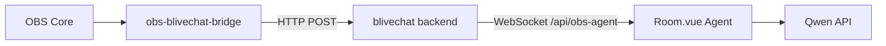

# OBS 与 blivechat-dev 通信

## blivechat-dev 安装到 OBS

`blivechat-dev` 本身是本地 Web 服务，不是 OBS 原生插件。正常使用方式是先启动本地服务，再在 OBS 中添加浏览器源。

```powershell
cd "c:\baidunetdiskdownload\My project\My project (3)\Library\blivechat-dev\blivechat-dev\frontend"
npm install
npm run build

cd "c:\baidunetdiskdownload\My project\My project (3)\Library\blivechat-dev\blivechat-dev"
pip install -r requirements.txt
python main.py
```

启动后打开 `http://localhost:12450`，生成房间 URL，然后在 OBS 中添加“浏览器源”并填入该 URL。

## OBS Bridge 插件

本仓库新增了 `obs-blivechat-bridge` 原生 OBS 插件骨架。它负责：

- 监听 OBS 推流开始/停止事件。
- 推流时每 10 秒触发一次 OBS 截图，并把截图文件路径上报给 blivechat 后端。
- 推流时采集 OBS 输出混音轨道，每 60 秒编码为 mono WAV base64，向后端上报 RMS/Peak 和音频片段。

后端接收接口：

- `POST /api/obs/event`
- `POST /api/obs/frame`
- `POST /api/obs/audio`
- `GET /api/obs/state`
- `WS /api/obs-agent`

`Room.vue` 会连接 `WS /api/obs-agent`，并把 OBS 状态放进 Agent 的 `metrics.obs` 字段。

## 多模态 Agent 汇报

新增两个后端 Qwen 接口：

- `POST /api/qwen/asr-report`：读取后端缓存的最新 OBS 混音音频片段，调用 `qwen3-asr-flash`，汇报主播正在做什么和语音外显心理状态。
- `POST /api/qwen/vision-report`：读取后端缓存的最新 OBS 截图路径，转成 base64 data URL 后调用 `qwen3.6-plus`，将直播场景归类为“游戏中”、“唱歌中”、“观看视频中”之一。

`Room.vue` 在 OBS 推流中定时触发：

- 每 60 秒触发一次语音观察，输出 `【语音观察】...`。
- 每 90 秒触发一次画面场景识别，输出 `【画面场景】...`。

`POST /api/obs/audio` 兼容旧字段，并新增：

```json
{
  "audioFormat": "wav",
  "audioData": "<base64 wav>",
  "durationSeconds": 60
}
```

`WS /api/obs-agent` 不下发 `audioData` / `imageData`，避免把大块媒体数据推到浏览器；多模态接口会在后端直接读取缓存。

## Windows 编译插件

推荐基于 OBS 官方插件模板构建。普通 OBS 安装目录只包含运行文件，通常不包含 `libobsConfig.cmake`、头文件和 `.lib` 导入库。

基本依赖：

- Visual Studio 2022
- Windows SDK 10.0.22621 或更新
- CMake 3.28 或更新
- OBS Studio 开发包，包含 `libobs` 和 `obs-frontend-api`
- CURL 开发库

本机已使用 `obs-plugintemplate` 构建并安装到 OBS 用户插件目录。重新构建命令如下：

```powershell
cd "c:\baidunetdiskdownload\My project\My project (3)\Library\blivechat-dev\blivechat-dev\obs-plugintemplate"
cmd /c "call ""C:\Program Files (x86)\Microsoft Visual Studio\2022\BuildTools\VC\Auxiliary\Build\vcvars64.bat"" && cmake --preset windows-x64"
cmd /c "call ""C:\Program Files (x86)\Microsoft Visual Studio\2022\BuildTools\VC\Auxiliary\Build\vcvars64.bat"" && cmake --build --preset windows-x64"
& "C:\Program Files\CMake\bin\cmake.exe" --install "build_x64" --config RelWithDebInfo --prefix "$env:APPDATA\obs-studio\plugins"
```

安装后的插件文件在：

```text
%APPDATA%\obs-studio\plugins\obs-blivechat-bridge\bin\64bit\obs-blivechat-bridge.dll
```

如果要安装到 `C:\Program Files\obs-studio`，需要用管理员权限运行安装命令。

## 通信流程



## 注意事项

当前插件上报截图文件路径和 60 秒混音音频片段。视觉模型在后端读取截图文件；ASR 模型在后端读取缓存的 WAV base64。若后续需要只采集单独麦克风源，需要在 OBS 插件中增加源选择配置，而不是使用当前的输出混音轨道。
