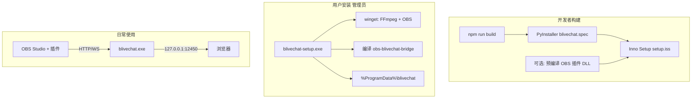

# blivechat Windows 客户端打包与安装

本目录提供将 **Python (Tornado) + Vue 前端** 打包为 Windows 桌面分发版，并在安装时自动处理依赖的方案。

## 架构概览



## 用户安装体验（图形化向导）

- **简体中文**安装界面（选择安装目录、开始菜单、桌面快捷方式）
- **「组件与空间」**页：显示程序体积估算、建议预留空间、当前磁盘可用空间
- **优先使用安装包内预置文件**：`vendor\obs-blivechat-bridge.dll`、可选 `vendor\ffmpeg\` 便携版
- **OBS Studio** 无法预制：未检测到时安装结束弹窗提示前往 https://obsproject.com/download
- **FFmpeg**：若安装包未附带且 winget 失败，弹窗提示下载地址
- 可选高级任务：**从源码编译 OBS 插件**（需 Visual Studio，默认不勾选）

## 用户安装要求

| 项目 | 说明 |
|------|------|
| 系统 | Windows 10/11 x64 |
| 权限 | **建议管理员身份运行**（安装插件到 Program Files OBS 目录时需要） |
| 网络 | 可选（仅 winget 自动装 OBS/FFmpeg 时需要；预置 DLL 不依赖网络） |
| 编译插件 | 仅在向导中勾选「从源码编译」时需要 VS2022 + C++ 工作负载 |

## 开发者：生成安装包

### 1. 准备环境

- Python 3.12+
- Node.js 18+（构建前端）
- [Inno Setup 6](https://jrsoftware.org/isinfo.php)
- （推荐）Visual Studio 2022 + CMake 3.28+，用于本地预编译 OBS 插件并打入安装包

### 2. 一键构建

```powershell
cd packaging\scripts
.\build-release.ps1
```

产物：

- 应用目录：`packaging\dist\blivechat\`
- 安装包：`packaging\installer\output\blivechat-setup-1.10.2.exe`（版本号来自 `frontend/package.json`）

仅重建安装包（已构建过前端与 exe）：

```powershell
.\build-release.ps1 -SkipFrontend -SkipPlugin
```

### 3. 分步说明

```powershell
# 前端
cd frontend
npm install
npm run build

# Python 依赖 + PyInstaller
pip install -r requirements.txt
pip install -r packaging\requirements-build.txt
cd packaging
python -m PyInstaller --noconfirm --clean blivechat.spec

# OBS 插件（开发机）
packaging\scripts\build-obs-plugin.ps1

# Inno Setup
& "${env:ProgramFiles(x86)}\Inno Setup 6\ISCC.exe" packaging\installer\setup.iss
```

## 安装程序行为

以管理员运行 `blivechat-setup-*.exe` 后自动执行 `post-install.ps1`：

1. **FFmpeg**：`winget install Gyan.FFmpeg`
2. **OBS Studio**：`winget install OBSProject.OBSStudio`
3. **数据目录**：`%ProgramData%\blivechat\data\config.ini`（从 `config.example.ini` 初始化）
4. **OBS 插件**：
   - 将 `obs-blivechat-bridge\src\obs-blivechat-bridge.cpp` 同步到包内 `obs-plugintemplate`
   - 使用 OBS 官方模板 CMake 预设 `windows-x64` 编译
   - 安装到 `%APPDATA%\obs-studio\plugins\obs-blivechat-bridge\`
   - 若 OBS 在 `Program Files` 且当前为管理员，额外复制 DLL 到 `obs-plugins\64bit`
   - 编译失败时回退到 `{app}\vendor\obs-blivechat-bridge.dll`（构建 release 时由开发者放入）

## 安装失败与 BUG 报告

所有安装步骤写入：

```text
%ProgramData%\blivechat\install.log
```

用户可从开始菜单运行 **「收集 BUG 报告」**，或在 PowerShell 中：

```powershell
& "$env:ProgramFiles\blivechat\packaging\scripts\collect-bug-report.ps1"
```

会在桌面生成 `blivechat-bug-report-*.zip`，包含安装日志、应用日志、PATH、OBS/插件路径等。

应用运行日志：

```text
%ProgramData%\blivechat\log\blivechat.log
```

若双击 exe 后窗口一闪就关、浏览器打不开页面，请先在 **cmd** 中运行以便看到控制台输出：

```bat
cd /d "C:\Program Files\blivechat"
blivechat.exe
```

安装日志（仅记录安装阶段，不包含 exe 崩溃栈）：

```text
%ProgramData%\blivechat\install.log
%ProgramData%\blivechat\install-result.json
```

## 运行时路径（打包版）

| 类型 | 路径 |
|------|------|
| 程序文件 | `{安装目录}\blivechat.exe` 与同目录 `_internal` |
| 用户配置/数据库 | `%ProgramData%\blivechat\data\` |
| 日志 | `%ProgramData%\blivechat\log\` |

可通过环境变量覆盖：

- `BLIVECHAT_DATA_DIR` — 数据目录
- `BLIVECHAT_LOG_DIR` — 日志目录

## 手动仅安装依赖 / 插件

```powershell
# 管理员 PowerShell
packaging\scripts\install-dependencies.ps1
packaging\scripts\build-obs-plugin.ps1 -ProjectRoot "C:\path\to\repo"
packaging\scripts\ensure-app-data.ps1 -AppDir "C:\Program Files\blivechat"
```

## 限制与说明

- **安装时编译 OBS 插件** 首次可能较慢（CMake 会下载 OBS 31.x 开发依赖，体积较大）。建议在 `build-release.ps1` 中预编译 DLL 并放入 `packaging\vendor\`，作为终端用户机器无 VS 时的回退。
- **winget** 在企业策略禁用或离线环境可能失败，需手动安装 FFmpeg/OBS 后重新运行 `build-obs-plugin.ps1`。
- **Windows**：本文档 + `build-release.ps1` + Inno Setup。
- **macOS**：见 [README-macos.md](./README-macos.md)，在 Mac 上运行 `packaging/scripts/build-release.sh`（无法从 Windows 交叉编译 `.app`）。

## 相关文档

- [docs/OBS_BRIDGE.md](../docs/OBS_BRIDGE.md) — OBS 桥接协议与手动编译说明
- [README.md](../README.md) — 项目使用教程
