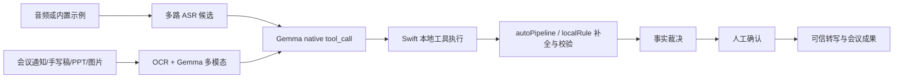

# Technical Report

## 项目概述

MeetingTruth 是一个基于 Gemma 4 的可信会议助手，面向会议录音转写不稳定、纪要生成易受识别错误影响的问题。系统将原始音频、多路 ASR 候选结果、会议材料、术语表和用户反馈统一输入 Gemma 4，由 Gemma 4 完成语义级转写仲裁、专业术语修正、低置信片段标注和人工确认提示，并进一步生成可信逐字稿、正式会议纪要、关键要点、待办事项和思维导图。

项目重点体现 Gemma 4 在音频、文本与会议材料之间的多模态语义融合能力，不只是简单的 ASR 拼接或文本摘要，而是通过 Gemma 4 对冲突信息进行判断、校验和组织，降低转写错误向会议结论、任务分派和后续执行扩散的风险。系统重点处理人名、金额、时间、项目名、系统名、承诺事项和专业术语这类高风险事实。

## Gemma 4 角色

正式演示推荐 `google/gemma-4-12b`，原因是它更适合长上下文、多模态材料、工具结果回读和结构化输出。`google/gemma-4-e4b` 作为 smoke test 或低配机器备用配置保留。

Gemma 4 在 MeetingTruth 中承担四类任务：

- 读取多路 ASR 候选和会议材料，找出高风险事实候选。
- 通过 native `tool_call` 请求 Swift 本地工具执行证据核验。
- 直接处理图片输入，结合 OCR 线索理解截图、白板、手写稿和 PPT。
- 在工具结果、人工确认和证据链之后生成可信转写、纪要、摘要、待办和思维导图。

## 工作流

## 当前真实工具链

MeetingTruth 使用 OpenAI-style tools schema 调用 Gemma native function calling。Gemma 返回 `tool_calls` 后，Swift 执行本地工具，并把 `role=tool` / `tool_response` 回填给模型做最终复核。

当前工具链为：

- `extract_meeting_fact_candidates`：从 ASR 候选、材料和图片线索中抽取需要复核的事实候选。
- `filter_reviewable_facts`：过滤低价值候选，只保留适合进入复核链路的事实。
- `detect_asr_conflicts`：检测多路 ASR 在人名、数字、时间、项目名和术语上的冲突。
- `retrieve_supporting_evidence`：检索会议通知、材料、OCR、Gemma 多模态图片理解和候选转写中的支持或反驳证据。
- `score_fact_candidates`：按 ASR 一致性、材料支持、图片证据和风险等级为候选评分。
- `make_fact_decision`：输出 accepted、corrected、conflicted 或 needsHumanReview 等事实裁决。
- `create_human_review_task`：只在证据不足或风险较高时创建人工确认任务。

这一设计避免模型只在提示词里“声称会核验”。高风险事实必须经过工具结果、Swift 本地记录和可展示审计链。

## Swift autoPipeline 与 localRule

真实 endpoint 支持 `tools/tool_calls` 时，Gemma 决定调用哪些工具。为了让新机器测试不被 endpoint 差异卡住，Swift 端还提供两层保护：

- `autoPipeline`：当模型没有完整返回工具链时，按当前真实工具顺序自动补全关键步骤，继续生成可审计记录。
- `localRule`：用本地规则做基础冲突和风险校验，尤其覆盖项目名、金额、日期、专有名词等明显差异。

UI 会区分 Gemma `tool_call`、`autoPipeline` 和 `localRule` 来源，方便验证哪些步骤来自模型原生工具调用，哪些是端侧补全或规则校验。

## 多模态与 OCR

图片材料不会只被当作普通附件。系统同时使用：

- OCR：提供可搜索、可定位的文字线索。
- Gemma 多模态：直接读取原图，复核截图上下文、手写痕迹、版面结构、可见数字和术语。

OCR 和多模态结果都只是证据链的一部分。当 ASR、图片和会议材料冲突时，系统不会强行确定答案，而是进入评分、裁决或人工确认。

## 人工确认

人工确认不是兜底弹窗，而是事实复核链路的一环。只有 `make_fact_decision` 认为事实冲突、证据不足或风险过高时，`create_human_review_task` 才会生成确认任务。用户确认结果会回写证据链，并影响最终可信转写和会议成果。

## 端侧实现

应用是 SwiftPM macOS App，核心目录在 `source/MeetingTruthMacApp/`。

关键文件：

- `Sources/MeetingTruth/Services/MeetingAIService.swift`：Gemma 4 请求、tools schema、多模态输入、tool_call 解析、工具执行和最终 JSON 解析。
- `Sources/MeetingTruth/Services/MeetingTruthCentralReviewEngine.swift`：中枢复核和工具结果回填后的裁决整理。
- `Sources/MeetingTruth/Services/MeetingTruthFactReviewEngine.swift`：事实证据核验和人工确认门禁。
- `Sources/MeetingTruth/Stores/LabStore.swift`：MeetingTruth 主工作流编排、示例数据、ASR 候选和成果生成。
- `Sources/MeetingTruth/Views/MeetingTruthWorkspaceView.swift`：主工作台、冲突卡片、处理链路和工具调用展示。

该 clean submission 从原 LocalASRLab 实验工程抽离，少量内部类型名保留历史语义，例如 `LabStore`。当前构建产物、普通用户入口和提交主功能均为 MeetingTruth。

## 验证策略

提交包验证包含：

- SwiftPM release 构建。
- ASR Python 脚本语法检查。
- 打包脚本排除 `.build`、DerivedData、venv、模型权重、旧 zip、staging 和用户隐私数据。
- `CHECKSUMS.sha256` 覆盖最终提交包内文件。
- 示例数据路径可用于无 ASR 模型的新机器演示。
