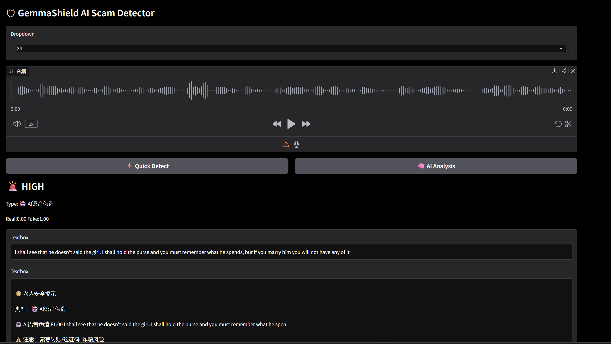
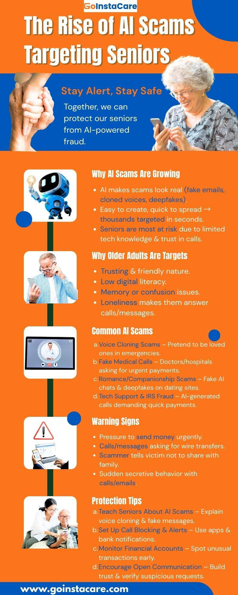
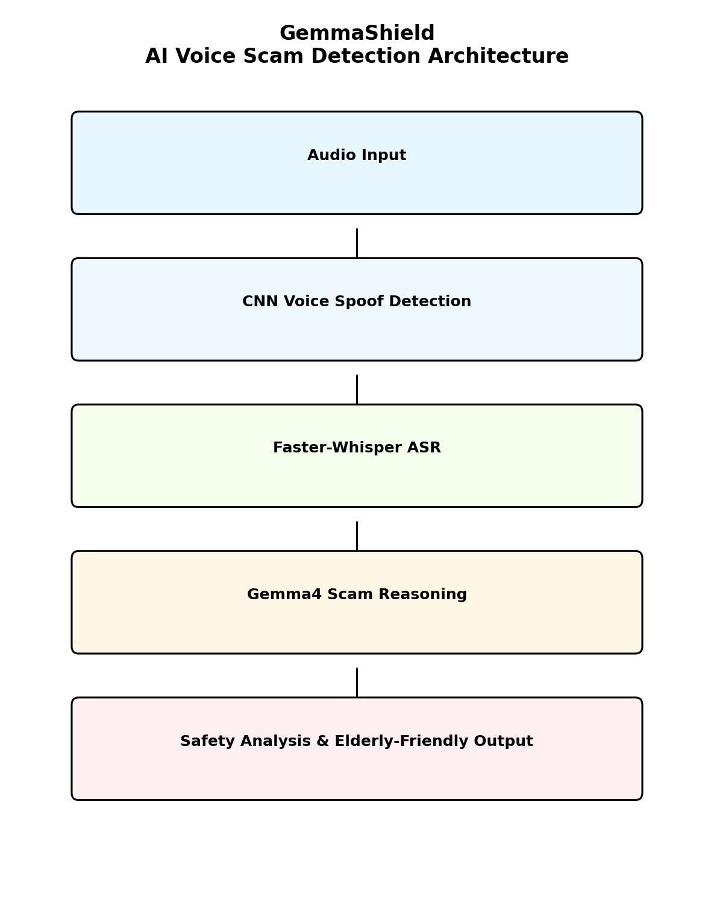
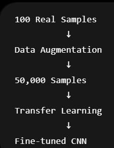

# 🛡️ GemmaShield
<p align="center">
  <a href="https://huggingface.co/spaces/Laura-smith/voice-spoof-detector">🌐 Live Demo</a> |
  <a href="./demo_video.mp4">🎥 Demo Video</a> |
  <a href="./gemmashield_technical_report.docx">📄 Technical Report</a>
  > Note: If the Hugging Face Space is temporarily inaccessible due to network restrictions or regional access limitations, please refer to `demo_video.mp4` for a full demonstration of the system. The complete source code and local setup instructions are also provided in this repository.
</p>

<p align="center">
  Protecting Elderly Users from AI Voice Scams with Explainable AI
</p>


## 📚 Table of Contents

- [Why GemmaShield Matters](#-why-gemmashield-matters)
- [User Journey](#-user-journey)
- [Project Goals](#-project-goals)
- [Why Gemma 4](#-why-gemma-4)
- [System Architecture](#-system-architecture)
- [Data Compliance and Privacy Protection](#-Data-Compliance-and-Privacy-Protection)
- [Voice Spoof Detection Research](#-voice-spoof-detection-research)
- [Explainable AI](#-explainable-ai-with-gemma-4)
- [Social Impact](#-social-impact)
- [Future Work](#-future-work)
# Protecting Elderly Users from AI Voice Scams with Explainable AI 

An AI-powered multimodal scam detection system that combines:

- Voice Spoof Detection
- Speech Recognition
- Large Language Model Reasoning
- Explainable AI Safety Analysis

to help elderly users identify increasingly sophisticated AI-generated scam calls.

Built with Google Gemma 4.

---

## 🌍 Why GemmaShield Matters

AI voice cloning technology is rapidly becoming accessible.

Today, scammers can generate highly realistic voices that imitate:

- family members
- friends
- government agencies
- bank representatives

with only a few seconds of recorded speech.

Older adults are particularly vulnerable to these attacks because:

- they often trust familiar voices
- they may have limited experience with AI-generated media
- voice-based scams frequently create urgency and emotional pressure

Unfortunately, most existing voice spoof detection systems only provide a probability score.

For non-technical users, outputs such as:

```text
Fake Probability: 0.82
```

do not explain:

- Why is this suspicious?
- What should I do next?
- How serious is the risk?

GemmaShield was created to bridge this gap.

Instead of functioning solely as an AI classifier, GemmaShield acts as an AI safety assistant capable of explaining risks in human language.
---

# 👵 User Journey

GemmaShield is designed around a simple workflow that elderly users can easily understand and operate.


```text
Suspicious Voice Message
            ↓
      Upload Audio
            ↓
 Voice Authenticity Check
            ↓
 Speech Transcription
            ↓
 Gemma 4 Scam Analysis
            ↓
 Risk Explanation
            ↓
 Safety Recommendation
```


# 🎯 Project Goals

GemmaShield aims to:

- Detect AI-generated fake voices
- Identify potential telecom fraud indicators
- Provide understandable explanations
- Assist elderly users in making safer decisions
- Explore robustness challenges in real-world deployment
- Study trustworthy AI systems for social good

---

# 🤖 Why Gemma 4

Traditional spoof detection systems stop at classification.

GemmaShield integrates Google Gemma 4 to transform detection results into actionable safety guidance.

Gemma 4 is used for:

- Scam transcript analysis
- Risk reasoning
- Fraud indicator detection
- Elderly-friendly explanation generation
- Bilingual communication support

This transforms the system from:

```text
Voice Classifier
```

into:

```text
Voice Safety Assistant
```

---
# 🚀 Gemma 4 Capabilities Used

GemmaShield uses Gemma 4 as a reasoning engine rather than a simple chatbot.

The model performs several safety-oriented tasks:

- Scam intent analysis
- Context-aware risk assessment
- Fraud indicator identification
- Elderly-friendly explanation generation
- Safety recommendation generation
- Bilingual response support

Reasoning workflow:

```text
Transcript
      ↓
Scam Signal Extraction
      ↓
Context Understanding
      ↓
Risk Assessment
      ↓
Human-Readable Advice
```

By integrating Gemma 4 into the decision-making pipeline, GemmaShield transforms raw machine learning outputs into explanations that can be understood by non-technical users.

This explainability is a core component of the system's social-good mission.

---


# 🏗 System Architecture

```text
Audio Input
      │
      ▼
CNN Voice Spoof Detection
      │
      ▼
Faster-Whisper Speech Recognition
      │
      ▼
Gemma 4 Reasoning Engine
      │
      ▼
Explainable Scam Assessment
      │
      ▼
Elderly-Friendly Safety Advice
```

---

# ⚙️ Core Technologies

| Component | Technology |
|------------|------------|
| Voice Spoof Detection | CNN |
| Speech Recognition | Faster-Whisper |
| AI Reasoning | Google Gemma 4 |
| Frontend | Gradio |
| Deployment | Hugging Face Spaces |
| Audio Features | Log-Mel Spectrogram |

---
## Data Compliance and Privacy Protection

GemmaShield is developed for research, educational, and social-good purposes. Since the project involves voice data, data compliance and privacy protection are important parts of the system design.

## Data Source Compliance

The voice spoof detection model in this project is trained using the ASVspoof dataset, which is a publicly available research dataset commonly used for academic research on automatic speaker verification and spoofing detection.

This project does not use illegally obtained recordings, private phone calls, or voice data collected without consent. The project also does not collect sensitive personal information from users, such as names, phone numbers, addresses, ID numbers, bank account information, passwords, or family information.

Any demo audio used in the project is only for testing, research, and competition demonstration purposes.

### Privacy Protection

GemmaShield does not require users to provide personal identity information. The system only analyzes the uploaded audio file to estimate whether the voice may be AI-generated and whether the transcript may contain scam-related risks.

The system is not designed to identify the real identity of the speaker. It does not intentionally store, publish, or share user-uploaded voice data.

Users are encouraged not to upload sensitive private conversations, financial information, passwords, or confidential family details.

### Responsible Use

GemmaShield is designed to help elderly users and their families identify potential AI voice scams. The system provides risk warnings, explanations, and safety suggestions, but it should not be treated as a final legal, financial, or law-enforcement decision.

This project should not be used for surveillance, unauthorized speaker identification, identity tracking, or any harmful purpose.
# 🔬 Voice Spoof Detection Research

A major focus of this project is understanding the gap between laboratory performance and real-world deployment.

---

## Training Dataset

Initial training used:

- ASVspoof Dataset
- Approximately 110,000 training samples

---

## Benchmark Performance

The CNN model achieved:

```text
EER ≈ 0.00134
```

on clean benchmark data.

This indicates extremely strong laboratory performance.

---

# ⚠️ Real-World Deployment Challenge

To evaluate practical robustness, we collected approximately:

```text
100 real-world audio samples
```

including:

- phone call recordings
- replay attacks
- compressed speech
- microphone variations
- noisy environments
- AI-generated voices

Direct evaluation revealed:

```text
EER ≈ 0.30
```

This demonstrated a severe domain gap between benchmark datasets and real-world audio.

---

# 📊 EER Comparison

| Dataset | EER |
|----------|----------|
| ASVspoof Benchmark | 0.00134 |
| Real-world Dataset | 0.30 |
| Augmented Dataset | 0.03 |

---

# 🔬 Data Augmentation Study


To address the limited size of real-world data, a custom augmentation pipeline was developed.

The original dataset of approximately:

```text
100 samples
```

was expanded into:

```text
50,000 augmented samples
```

using:

- Noise Injection
- Pitch Shifting
- Replay Simulation
- Frequency Perturbation
- Audio Distortion
- Waveform Modification

Metadata and labels were synchronized automatically.

---

# 🧠 Transfer Learning Strategy

Instead of retraining from scratch:

1. ASVspoof-pretrained CNN was retained
2. Early layers were frozen
3. Remaining layers were fine-tuned
4. Augmented real-world data was used for adaptation

Result:

```text
EER ≈ 0.03
```

---

# 🔍 Key Research Finding

One of the most important discoveries of this project was:

> Extremely low benchmark EER does not guarantee real-world robustness.

Although fine-tuning improved validation performance, additional testing revealed:

- improved recognition of genuine speech
- reduced generalization to unseen spoof attacks

This suggests that the model may learn characteristics of "realness" rather than generalized spoof patterns.

This finding highlights an important challenge for future AI security research.

---
# 📖 Lessons Learned

This project revealed that benchmark performance alone is not sufficient for evaluating real-world AI security systems.

Through multiple rounds of experimentation, we observed that:

- Extremely low EER values can be misleading.
- Data augmentation improves validation metrics but may introduce overfitting.
- Real-world robustness remains a major challenge.
- Explainability is essential when deploying AI systems for vulnerable populations.

The most valuable outcome of this project is not the lowest EER achieved, but the understanding of the gap between laboratory evaluation and practical deployment.

These findings motivate our future research on robustness, trustworthy AI, and human-centered security systems.

# 🔄 Current Deployment Strategy

Because robustness remains a critical challenge, the deployed system currently uses:

- ASVspoof-trained CNN
- stable inference pipeline
- conservative deployment strategy

Future robustness research continues separately.

---

# 🧠 Explainable AI with Gemma 4
Gemma 4 receives:

- Speech transcript
- Spoof probability
- Contextual scam indicators
## 🧠 Gemma 4 Reasoning Pipeline
```
Transcript
+
Spoof Probability
+
Risk Signals
      ↓
Gemma 4
      ↓
Risk Level
Reason
Recommendation
```
and generates explanations such as:

```text
Potential Scam Detected

Risk Level: Medium

Reason:
The caller requests urgent financial action
while claiming to be a family member.

Recommendation:
Verify identity through another communication channel
before sending money.
```

This makes detection results understandable for elderly users.

---

# 👵 Elderly-Friendly Design

GemmaShield is specifically designed for older adults.

Features include:

- Large fonts
- Simple interaction flow
- Chinese / English support
- Readable AI explanations
- Clear risk categories
- Actionable recommendations

The objective is not only detection accuracy, but user understanding.

---

# 🚀 Features

✅ Voice Spoof Detection

✅ Scam Risk Analysis

✅ Faster-Whisper Transcription

✅ Gemma 4 Reasoning

✅ Explainable AI

✅ Elderly-Friendly Interface

✅ Chinese / English Support

✅ Hugging Face Deployment

✅ Real-Time Audio Upload

---
# 👥 Target Users

GemmaShield is designed for:

- Elderly individuals vulnerable to voice scams
- Family members helping older relatives
- Community centers and senior-care organizations
- Researchers studying AI safety and voice trustworthiness

The system focuses on accessibility, transparency, and trust rather than purely maximizing benchmark performance.


# 🌍 Social Impact

GemmaShield addresses a growing societal challenge:

AI-generated voice scams targeting vulnerable populations.

The project contributes to:

- AI Safety
- Elderly Protection
- Digital Trust
- Explainable AI
- Responsible AI Deployment

As voice cloning technology becomes increasingly powerful, systems capable of explaining risks may become an important component of future digital safety infrastructure.

---

# ⚠️ Current Limitations

Current limitations include:

- Real-world spoof detection remains challenging
- Unseen attack types may reduce performance
- Background noise may affect transcription quality
- Scam assessment should assist, not replace, human judgment

---
# 🏆 Alignment with Gemma 4 Hackathon

GemmaShield was developed for the Gemma 4 Developer Competition under the Social Good track.

The project aligns with the competition goals by:

- Addressing a real-world societal challenge
- Protecting vulnerable populations
- Leveraging Gemma 4 for explainable reasoning
- Exploring trustworthy AI deployment
- Investigating robustness limitations in practical environments

Rather than focusing solely on benchmark performance, GemmaShield emphasizes real-world usability, transparency, and human-centered AI safety.

The project demonstrates how modern language models can be integrated into security systems to provide meaningful assistance beyond simple classification outputs.

# 🔮 Future Work

Future directions include:

- Real-time phone call protection
- Streaming audio analysis
- Edge-device deployment
- Multilingual scam detection
- Adversarial spoof defense
- Improved robustness training
- Function Calling integration with Gemma 4

---

# 📁 Project Structure

```text
GemmaShield/
│
├── app.py
├── model.py
├── train.py
├── inference.py
├── best_model.pth
├── requirements.txt
├── fake_data/
├── real_data/
├── architecture.png
├── eer_chart.png
├── demo.png
├── technical_report.pdf
├── demo_video.mp4
└── README.md
```

---

# 👨‍💻 Author

Developed as an independent research and engineering project exploring:

- AI Security
- AI Safety
- Voice Trustworthiness
- Human-Centered AI
- Explainable AI
- Multimodal AI Systems

---

# 📄 License

This project is intended for research and educational purposes.

MIT License.
